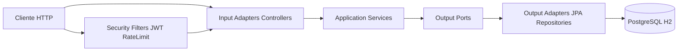

# Documentacao Completa do Microsservico - Gastro Factor API

## 1. Objetivo

O Gastro Factor API e um microsservico REST para:

- calcular informacoes nutricionais de alimentos com base em peso e tipo de preparo
- cadastrar e listar receitas com seus componentes nutricionais
- autenticar usuarios com JWT + refresh token

## 2. Escopo Funcional

### 2.1 Modulo de Autenticacao

Responsavel por registro, login, renovacao de token e logout com revogacao.

### 2.2 Modulo de Calculadora

Recebe alimento, peso e tipo de peso para retornar valores calculados.

### 2.3 Modulo de Receitas

Permite criar e listar receitas com detalhes, ingredientes, valores nutricionais e modo de preparo.

## 3. Arquitetura

Padrao utilizado: Arquitetura inspirada em Hexagonal (Ports and Adapters).

### 3.1 Camadas

- `adapters/input`: controllers e DTOs de entrada
- `adapters/output`: persistencia e mapeamento de dados
- `application`: comandos e servicos de aplicacao
- `ports`: contratos de entrada e saida
- `infrastructure`: seguranca, configuracao e tratamento de excecoes
- `shared`: utilitarios comuns

### 3.2 Diagrama



## 4. Endpoints da API

Base path: `http://localhost:8080`

### 4.1 Autenticacao

#### `POST /v1/auth/register`

- acesso: publico
- request:

```json
{
  "name": "Maria",
  "email": "maria@email.com",
  "password": "Senha@123",
  "occupation": "Nutricionista"
}
```

- response `201`:

```json
{
  "accessToken": "jwt",
  "refreshToken": null
}
```

#### `POST /v1/auth/login`

- acesso: publico
- observacao: sujeito a rate limit por IP
- request:

```json
{
  "email": "maria@email.com",
  "password": "Senha@123"
}
```

- response `200`:

```json
{
  "accessToken": "jwt",
  "refreshToken": "uuid-refresh"
}
```

#### `POST /v1/auth/refresh/{token}`

- acesso: publico
- path param: refresh token atual
- response `200`:

```json
{
  "accessToken": "novo-jwt",
  "refreshToken": "novo-refresh-token"
}
```

#### `POST /v1/auth/logout`

- acesso: requer header `Authorization: Bearer <access-token>`
- request body:

```json
{
  "refreshToken": "uuid-refresh"
}
```

- response `204`
- efeitos:
  - revoga refresh token
  - inclui access token na blacklist

### 4.2 Calculadora

#### `POST /v1/calculator`

- acesso: publico (permitAll por decisao de produto)
- request:

```json
{
  "foodName": "Peito de Frango",
  "foodWeight": 900.00,
  "typeWeight": "COOKED"
}
```

- response `200`: retorna payload de calculo nutricional

### 4.3 Receitas

#### `POST /v1/recipes`

- acesso: autenticado
- request:

```json
{
  "details": {
    "name": "Nome da receita",
    "servings": 4,
    "category": "Prato principal"
  },
  "ingredients": [
    {
      "name": "Tomate",
      "netWeight": 200,
      "correctionFactor": 1.1,
      "grossWeight": 220,
      "cookingFactor": 0.9,
      "totalQuantity": 198
    }
  ],
  "nutritional": {
    "calories": 350,
    "protein": 20,
    "totalFat": 15,
    "carbs": 30
  },
  "preparationMethods": [
    {
      "ordinationId": 1,
      "title": "Cozinhar",
      "description": "Cozinhe os ingredientes por 10 minutos."
    }
  ]
}
```

- response `201`: UUID da receita

#### `GET /v1/recipes`

- acesso: autenticado
- response `200`: lista de receitas

## 5. Seguranca

## 5.1 Politica de acesso

- `/v1/auth/**`: publico
- `/v1/calculator/**`: publico
- `/v1/recipes/**`: autenticado
- `/h2-console/**`: publico (com config dedicada)

## 5.2 JWT

- segredo obrigatorio em `jwt.secret`
- minimo de 32 bytes
- token de acesso com expiracao curta (~15 min)
- refresh token com ciclo de revogacao/substituicao

## 5.3 Hardening implementado

- validacao robusta no filtro JWT
- retorno `401` para token invalido/expirado/revogado
- blacklist de token no logout
- login com rate limit por IP

## 5.4 Rate limiting

Aplicado em `POST /v1/auth/login`.

Headers de resposta ao estourar limite:

- `Retry-After`
- `X-RateLimit-Limit`
- `X-RateLimit-Window-Minutes`

Propriedades:

- `app.security.rate-limit.login.attempts`
- `app.security.rate-limit.login.minutes`

## 6. Persistencia e Banco

## 6.1 Banco padrao

- PostgreSQL (producao/default)
- H2 (cenarios locais/default profile para testes rapidos)

## 6.2 Migracoes Flyway

Local: `src/main/resources/db/migrations`

- `V1__init.sql`: baseline inicial
- `V2__create_application_schema.sql`: schema completo
- `V3__add_unique_index_user_email.sql`: indice unico em email

## 6.3 Tabelas principais

- `userentity`
- `refreshtokenentity`
- `jwtblacklistentity`
- `recipeentity`
- `detailsentity`
- `ingrediententity`
- `nutritionalentity`
- `preparationmethodentity`
- `foodprofileentity`
- `foodnutritionentity`
- `foodpreparationentity`

## 7. Configuracao

## 7.1 Variaveis de ambiente

Obrigatorias:

- `JWT_SECRET`

Banco de dados:

- `DB_HOST` (default: localhost)
- `DB_PORT` (default: 5432)
- `DB_NAME` (default: GastroFactor)
- `DB_USER` (default: postgres)
- `DB_PASS` (default: admin)

Servidor:

- `SERVER_PORT` (default: 8080)

Rate limit:

- `RATE_LIMIT_LOGIN_ATTEMPTS` (default: 5)
- `RATE_LIMIT_LOGIN_MINUTES` (default: 1)

Local profile:

- `JWT_SECRET_LOCAL` (fallback local somente para profile local)

## 7.2 Perfis

- `application.yml`: configuracao principal
- `application-default.yml`: defaults locais/endurecidos
- `application-local.yml`: override local, incluindo seed

## 7.3 Seed de catalogo

Carga CSV controlada por:

- `app.seed.enabled`

No profile local esta habilitado.

## 8. Observabilidade e Operacao

## 8.1 Actuator

- endpoint de health habilitado
- probes de liveness/readiness habilitadas
- exposicao restrita de endpoints

## 8.2 CORS

Origens permitidas:

- `http://localhost:4200`
- `https://gastrofactor.onrender.com`

## 9. Qualidade, Testes e CI

## 9.1 Testes existentes

- testes de dominio da calculadora
- testes de utilitario JWT
- testes de integracao de seguranca
- teste de contexto da aplicacao

Comandos:

```bash
./mvnw test
./mvnw verify
```

## 9.2 CI

Workflow principal: `.github/workflows/ci.yml`

Pipeline:

- valida segredo obrigatorio
- compila e executa testes (`mvn verify`)
- gera cobertura JaCoCo
- aplica gate progressivo de cobertura

Regra progressiva de cobertura de linha:

- default (demais branches): 19%
- main/master: 25%
- release/*: 50%
- tags: 70%

## 9.3 SAST

Workflow: `.github/workflows/codeql.yml`.

## 10. Build e Deploy

## 10.1 Build local

```bash
./mvnw clean package
```

## 10.2 Docker

```bash
docker build -t gastro-factor-api .
docker run --rm -p 8080:8080 -e JWT_SECRET="12345678901234567890123456789012" gastro-factor-api
```

## 11. Tratamento de Erros

ControllerAdvice global:

- `MethodArgumentNotValidException` -> `400`
- `BusinessException` -> mapeamento por codigo
- `ApplicationBusinessException` -> mapeamento por status

Formato padrao encapsulado em `ApiErrorResponse`.

## 12. Riscos Tecnicos e Melhorias Futuras

- elevar cobertura gradualmente para metas mais fortes
- ampliar testes de contrato e cenarios de erro
- revisar o endpoint de refresh para padrao body/header (evitar token em path)
- remover pontos restantes de acoplamento entre camadas

## 13. Guia Rapido de Troubleshooting

### Erro: `jwt.secret nao pode ser vazio`

Defina `JWT_SECRET` com minimo de 32 bytes.

### Erro de `401` em receitas

Verifique envio de `Authorization: Bearer <token>`.

### Erro de `429` no login

Aguarde a janela de rate limit (`Retry-After`) ou ajuste limites por variavel.

### Falha em migracoes Flyway

Valide credenciais de banco e consistencia das versoes em `db/migrations`.

## 14. Referencias Internas

- README principal: `README.md`
- analise final: `docs/ANALISE_FINAL_POS_IMPLEMENTACAO.md`
- backlog de melhorias: `docs/ANALISE_MELHORIAS.md`
